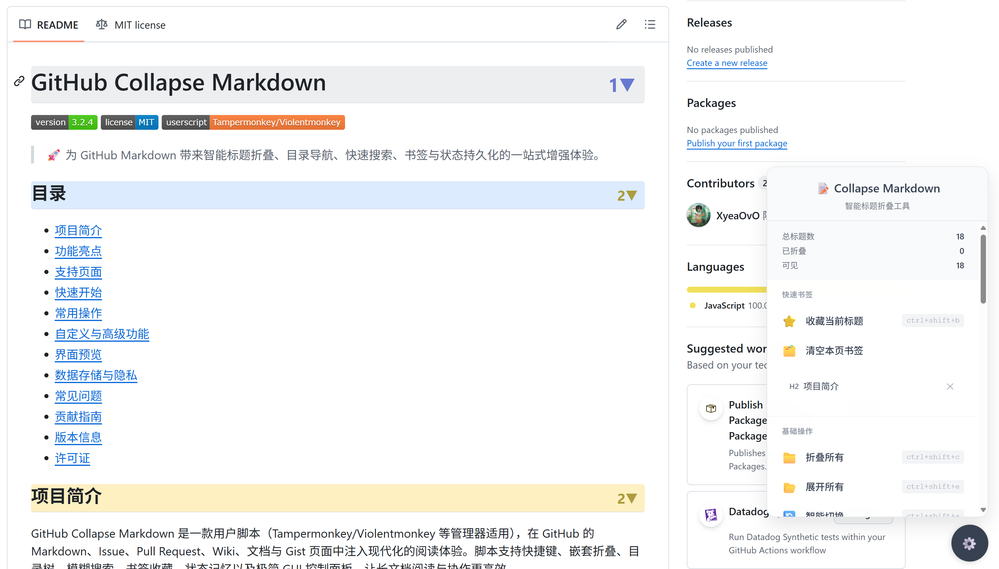

# GitHub Collapse Markdown

> 🚀 为 GitHub Markdown 带来智能标题折叠、目录导航、快速搜索、书签与状态持久化的一站式增强体验。

## 目录
- [项目简介](#项目简介)
- [功能亮点](#功能亮点)
- [支持页面](#支持页面)
- [快速开始](#快速开始)
- [常用操作](#常用操作)
- [自定义与高级功能](#自定义与高级功能)
- [界面预览](#界面预览)
- [数据存储与隐私](#数据存储与隐私)
- [常见问题](#常见问题)
- [贡献指南](#贡献指南)
- [版本信息](#版本信息)
- [许可证](#许可证)

## 项目简介
GitHub Collapse Markdown 是一款用户脚本（Tampermonkey/Violentmonkey 等管理器适用），在 GitHub 的 Markdown、Issue、Pull Request、Wiki、文档与 Gist 页面中注入现代化的阅读体验。脚本支持快捷键、嵌套折叠、目录树、模糊搜索、书签收藏、状态记忆以及极简 GUI 控制面板，让长文档阅读与协作更高效。

## 功能亮点
- **智能折叠引擎**：单击标题即可折叠/展开，支持嵌套层级、Shift+点击批量操作以及滚动定位。
- **现代化浮动菜单**：右下角按钮呼出控制面板，集中管理折叠、目录、搜索、书签、配色、性能模式等功能。
- **目录导航面板**：树形结构展示所有标题，同步折叠状态与当前高亮，整行可点击或键盘触发跳转。
- **即时标题搜索**：模糊匹配、级别过滤、键盘上下键切换结果，Enter/Shift+Enter 跳转到命中标题。
- **书签系统**：为常用段落打卡收藏，跨会话保存，随时回访并支持一键清理。
- **多场景兼容**：支持 GitHub 原生 PJAX/Turbo 导航、锚点跳转、夜间主题与第三方 DOM 变更。
- **状态记忆**：按页面 URL 保存折叠、书签、配色、热键与 UI 偏好，刷新后自动恢复阅读进度。
- **无障碍体验**：ARIA 属性同步、键盘操作、可选辅助提示，适配 GitHub 原生样式与暗色模式。

## 支持页面
- `https://github.com/*` 仓库 README、Issue、Discussions、Pull Request、Wiki
- `https://gist.github.com/*`
- `https://help.github.com/*`
- `https://docs.github.com/*`

其他 GitHub 子域若包含 `.markdown-body` 或 `.comment-body` 区域，也会自动启用脚本。

## 快速开始
1. **安装脚本管理器**（如 [Tampermonkey](https://www.tampermonkey.net/)、[Violentmonkey](https://violentmonkey.github.io/) 或 [Userscripts](https://github.com/quoid/userscripts)）。
2. **安装脚本**：在浏览器地址栏打开 [`main.js` 原始链接](https://raw.githubusercontent.com/Xyea/GitHub-Collapse-Markdown/main/main.js)，脚本管理器会提示确认安装。
3. **刷新 GitHub 页面**：右下角会出现一个圆形浮动菜单按钮，点击或使用 `Ctrl+Shift+M`（macOS 使用 `⌘`+`Shift`+`M`）打开控制面板开始使用。

脚本将随脚本管理器自动更新；若需要手动检查更新，可在管理器中启用“自动检查更新”或重新访问原始链接覆盖安装。

## 常用操作
### 标题折叠与定位
- 左键点击任意标题折叠/展开对应内容；嵌套标题会保持当前层级状态。
- `Shift + 单击`：同步折叠/展开当前层级的所有同级标题。
- 页面滚动后会自动高亮当前视窗中的标题，目录面板会同步定位。

### 快捷键总览
> macOS 用户使用 `⌘` 代替下表中的 `Ctrl`。可在菜单中总开关，部分键位可通过 Tampermonkey 菜单自定义。

| 功能 | 快捷键 | 说明 |
| --- | --- | --- |
| 折叠全部标题 | `Ctrl + Shift + C` | 将所有内容折叠为标题概览 |
| 展开全部标题 | `Ctrl + Shift + E` | 展开所有层级 |
| 智能切换 | `Ctrl + Shift + A` | 根据当前状态自动折叠或展开 |
| 打开控制面板 | `Ctrl + Shift + M` | 呼出/隐藏右下角 GUI 菜单 |
| 打开目录导航 | `Ctrl + Shift + L` | 显示树形目录，可键盘操作 |
| 搜索标题 | `Ctrl + Shift + F` | 打开搜索框，实时筛选标题 |
| 收藏当前标题 | `Ctrl + Shift + B` | 将当前可见标题加入书签（可自定义） |
| 下一/上一标题 | `J` / `K` | 启用 Vim 导航后可用，快速在标题间跳转 |

### 浮动菜单面板
- **状态统计**：实时显示标题总数、已折叠数量和当前可见数量。
- **折叠控制**：折叠/展开/智能切换、刷新状态记忆、清除全局记忆。
- **工具集合**：一键打开目录、搜索、书签管理、使用帮助。
- **快速切换**：性能模式、状态记忆、快捷键总开关、Vim 导航、调试模式、展示级别数字。
- **外观设置**：在预设配色（Default/Pastel/Vibrant/Mono）之间切换或输入自定义色组，调整折叠箭头尺寸与显示样式。

### 目录、搜索与书签
- **目录导航**：支持整行点击、回车/空格触发、折叠状态同步以及活动标题高亮。
- **标题搜索**：勾选标题级别过滤、使用上下方向键在结果中移动，Enter 跳转、Shift+Enter 回到上一个命中项。
- **书签系统**：在当前视窗捕获标题并保存，支持重复点击取消收藏、列表中直接跳转、单条移除或一键清空。

## 自定义与高级功能
- **性能模式**：在长篇文档中禁用动画（仅即时隐藏/显示），提升切换速度。
- **状态记忆**：按页面唯一 URL 保存折叠与书签数据，可在菜单中随时清空或禁用。
- **快捷键管理**：菜单中可一键启用/禁用全局快捷键；通过 Tampermonkey 菜单可定制“收藏标题”等特定热键。
- **Vim 导航**：启用后支持 `J/K` 在标题间跳转，配合目录和搜索更高效。
- **调试模式**：在控制台输出详细日志，便于排查与其他脚本的兼容性问题。
- **自定义配色与箭头样式**：输入自定义色值（支持 Hex/RGB/命名色），设置折叠箭头字号或改为显示层级数字。
- **帮助面板**：菜单中的“使用说明”会打开一份内置使用指南，适合快速查阅快捷键、技巧与设置项。

## 界面预览

## 数据存储与隐私
脚本依赖脚本管理器的 `GM_setValue / GM_getValue` API 储存必要信息，均保存在本地浏览器中，不会上传或同步到远端。主要持久化内容包括：
- 折叠状态、展开偏好（按页面 URL）
- 书签列表与标题定位信息
- 快捷键、性能模式、Vim 导航、调试模式等偏好
- 自定义配色方案与箭头字号

若需要清除：
- 在浮动菜单选择“清除记忆”会删除所有页面的状态缓存。
- 在脚本管理器中删除脚本或重置存储也会移除全部数据。

## 常见问题
**Q1：安装后页面没有浮动菜单？**  
确认脚本管理器已启用脚本，并在 GitHub 页面刷新后再次查看。部分浏览器需要允许脚本运行在 `github.com` 域名。

**Q2：标题折叠无效或 UI 被覆盖？**  
可能与其他自定义样式或脚本发生冲突，可开启“🐛 调试模式”查看控制台日志，或暂时禁用其他脚本排查。

**Q3：想恢复默认状态怎么办？**  
在浮动菜单点击“重置状态”清除当前页面折叠，在“清除记忆”中移除所有页面缓存；必要时可在脚本管理器中移除脚本重新安装。

如遇其他问题或希望新增功能，欢迎通过 [Issues](https://github.com/Xyea/GitHub-Collapse-Markdown/issues) 提交反馈。

## 贡献指南
欢迎提交 Issue、Pull Request 或使用体验建议：
1. Fork 本仓库并创建分支。
2. 修改 `main.js`，保持 ES2015+ 语法与现有代码风格，必要时增加注释说明复杂逻辑。
3. 在实际 GitHub 页面中调试（Tampermonkey 可加载本地文件），确保功能在暗色/亮色模式及 PJAX 导航下正常工作。
4. 提交 PR 前请描述所做更改、影响范围与测试方式。

## 版本信息
- 当前公开版本：**3.3.0**
- 更新重点：现代化 GUI、目录面板、搜索面板、书签系统、性能模式、状态记忆与可自定义配色。

后续计划将持续优化长文档性能、提升目录同步体验并完善国际化支持。

## 许可证
本项目采用 [MIT License](LICENSE)。在保留版权和许可证声明的前提下，您可以自由地使用、复制、修改、合并、出版、分发、再许可和/或销售本脚本。

